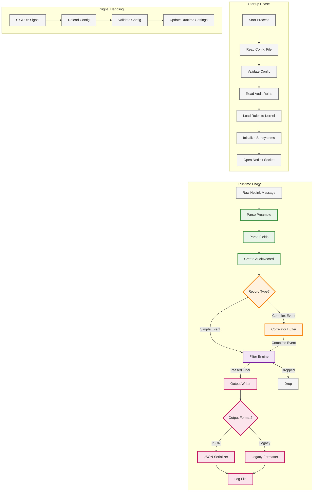

Below is a detailed flowchart illustrating the architecture and data flow of the audit processing system. Steps that correspond to specific source files are color-coded for clarity, though not all steps are mapped yet. Feel free to let me (Callie) know if you have suggestions.

- 🟢 **Green** - `parser.rs`
- 🟠 **Orange** - `correlator.rs`
- 🟣 **Purple** - `filter.rs`
- 🔴 **Red** - `writer.rs`
- ⚪ **Gray** - TBD