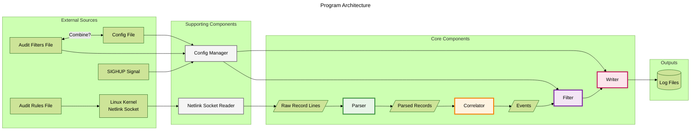

# Terms and Definitions
- **Audit Record**: A structured representation of an audit event, containing fields such as timestamp, event type, user ID, etc.
- **Audit Event**: A single occurrence of an action or operation that is logged by the audit system.
  - **Simple Event** - An event that is fully contained within a single audit record.
  - **Complex Event** - An event that spans multiple audit records. Correlated via PID and timestamp.
- **Audit Rules**: Configurations applied to the kernel to specify what events are emitted.
  - These are loaded from a rules file at startup. Since it talks to the kernel, we should keep the legacy format.
  - The legacy format is quite opaque, so writing our own wrapper around it is a stretch goal.
- **Audit Filters**: User-defined criteria to determine which audit records should be logged or discarded.
  - This lives completely in userspace, meaning we have free reign to define our own format.
- **Configurations**: Any setting that is not a filter or rule, such as log file paths, log rotation policies, etc. These are all managed in userspace.

# Program flowchart
Below is a detailed flowchart illustrating the architecture and data flow of the audit processing system.

Notes:
- There are definitely optimizations that this flowchart does not cover, such as skipping correlation for simple events, or early filtering.
- This flowchart is probably not complete, and may be missing components. This is all I (callie!) could wrap my head around though.